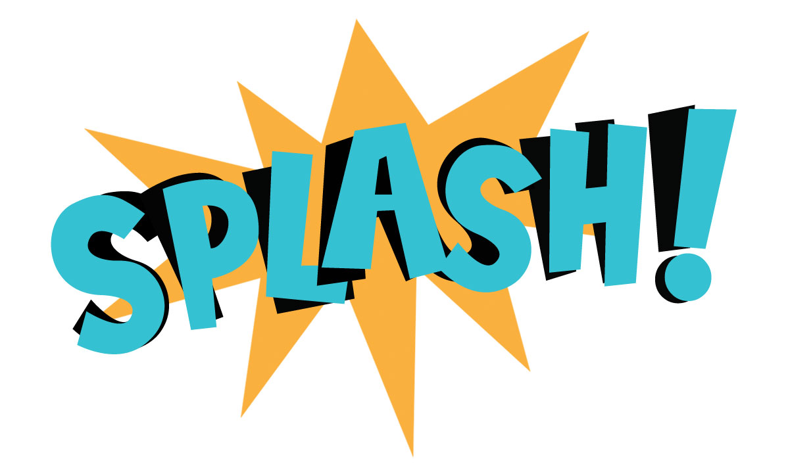

<div align="center" id="top"> 
  

  &#xa0;

  <!-- <a href="https://splashmem.netlify.app">Demo</a> -->
</div>

<h1 align="center">Splashmem</h1>

<p align="center">
  

  

  

  

  <!--  -->

  <!--  -->

  <!--  -->
</p>

<!-- Status -->

<h4 align="center"> 
	🚧  Splashmem 🚀 Under construction...  🚧
</h4> 

<hr>

<p align="center">
  <a href="#dart-about">About</a> &#xa0; | &#xa0; 
  <a href="#sparkles-features">Features</a> &#xa0; | &#xa0;
  <a href="#rocket-technologies">Technologies</a> &#xa0; | &#xa0;
  <a href="#white_check_mark-requirements">Requirements</a> &#xa0; | &#xa0;
  <a href="#checkered_flag-starting">Starting</a> &#xa0; | &#xa0;
  <a href="#memo-license">License</a> &#xa0; | &#xa0;
  <a href="https://github.com/Inserer-Pseudo" target="_blank">Author</a>
</p>

<br>

## :dart: About ##

Splashmeme est un jeu type "Splatoon" mais uniquement en 2D. Les joueurs sont également des fichiers textes ayant chacun une liste d'action.

## :sparkles: Features ##

:heavy_check_mark: Les joueurs sont des fichiers externes\
:heavy_check_mark: Gestion de plein d'action différentes !\
:heavy_check_mark: Affichage dynamique : waouh !\
:heavy_check_mark: Le grand gagnant est annoncé à la fin

## :rocket: Technologies ##

The following tools were used in this project:

- [SDL2](https://www.libsdl.org/)

## :white_check_mark: Requirements ##

Before starting :checkered_flag:, you need to have [Git](https://git-scm.com) and at least an RTX 4090 GPU ;)

## :checkered_flag: Starting ##

```bash
# Clone this project
$ git clone https://github.com/Inserer-Pseudo/splashmem

# Access
$ cd splashmem

# Install dependencies
$ sudo apt-get intall libsdl2-dev

# Compile the project
$ make all

# Run the project with our player examples
$ ./run.sh

#A window should appear
```

## :memo: License ##

This project is under license from POLYTECH. For more details, see the [LICENSE](LICENSE.md) file.


Made by <a href="https://github.com/Inserer-Pseudo" target="_blank">Mathis & Benjamin</a>
<!--with :heart: -->
&#xa0;

<a href="#top">Back to top</a>

